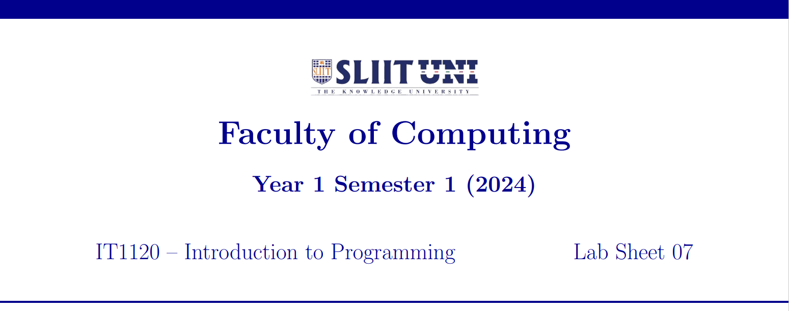
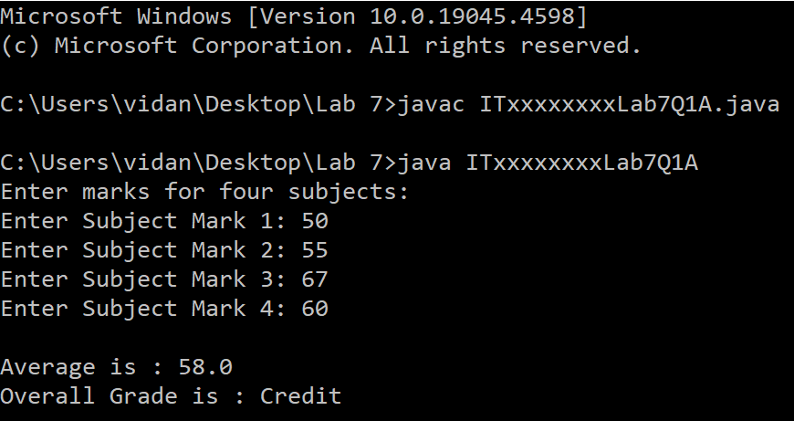
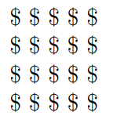
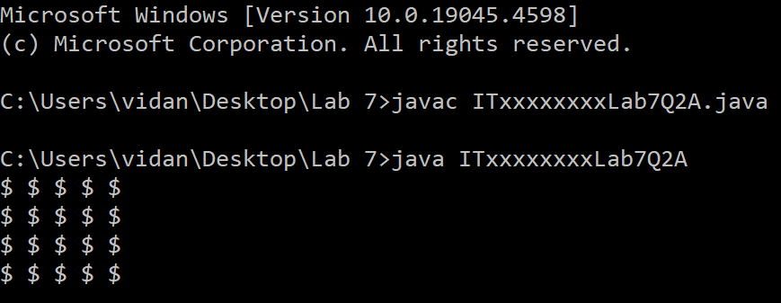
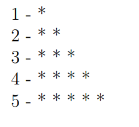
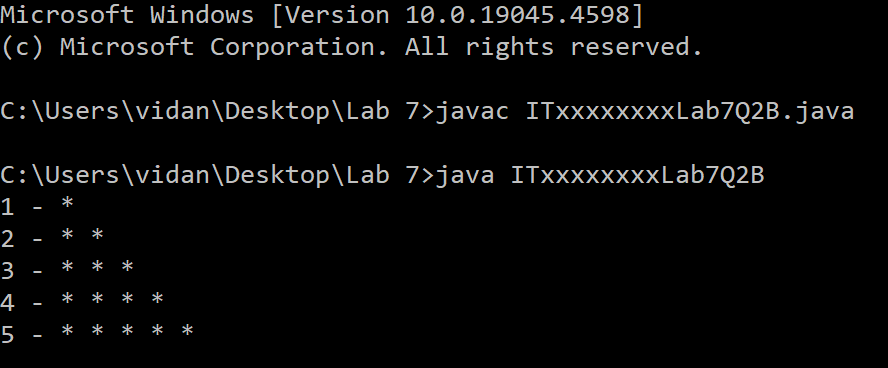
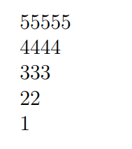
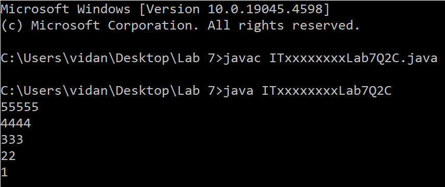
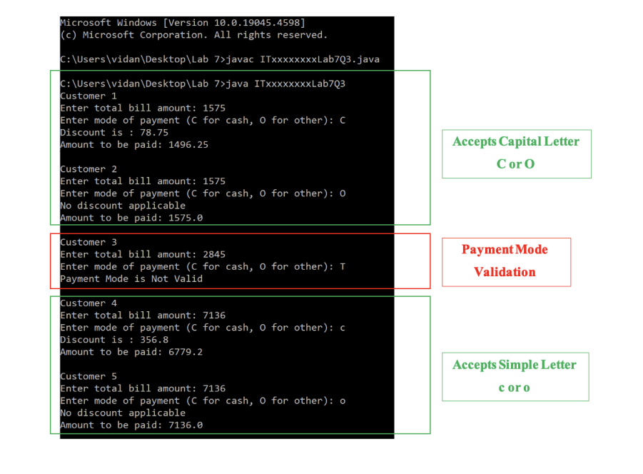

  

    
  

### Question 1 (Tutorial 6 – Q1)

**a)** Write a Java program to display the grade of a student.

The user should enter marks for four subjects and find the average. The overall grade (based on average) is assigned as follows:

| Marks         | Grade        |
|---------------|--------------|
| 100 - 75      | Distinction  |
| 74 - 50       | Credit       |
| 49 - 0        | Fail         |

Save the file inside '**Lab 7**' folder as: **ITxxxxxxxxLab7Q1A.java**  
Replace 'ITxx xxx xxx' of the filename, with your own Student ID.

Expected Output:

  

    
  

  **b)** Modify your program to get four subjects inputs in a single line (separated by space) and display the grades for three (3) students.

Save the file inside '**Lab 7**' folder as: **ITxxxxxxxxLab7Q1B.java**  
Replace 'ITxx xxx xxx' of the filename, with your own Student ID.

Expected Output:

  

    
  

### Question 2 (Tutorial 6 – Q2)

**a)** Write a Java program to display the below figure:

  

    
  

Save the file inside '**Lab 7**' folder as: **ITxxxxxxxxLab7Q2A.java**  
Replace 'ITxx xxx xxx' of the filename, with your own Student ID.

Expected Output:

  

    
  

**b)** Write a Java program to display numbers from 1 -- 5 and display the stars as shown below:

  

    
  

Save the file inside '**Lab 7**' folder as: **ITxxxxxxxxLab7Q2B.java**  
Replace 'ITxx xxx xxx' of the filename, with your own Student ID

Expected Output:

  

    
  

  **c)** Write a Java program to display the following pattern:

  

    
  

Save the file inside '**Lab 7**' folder as: **ITxxxxxxxxLab7Q2C.java**  
Replace 'ITxx xxx xxx' of the filename, with your own Student ID.

  

    
  

### Question 3 (Tutorial 6 – Q3)

SunSet supermarket has decided to give a 5% discount to the total bill amount during the festive season. A discount is given only to the customers who pay the bill in cash.

Write a Java program to enter the total bill amount of 5 customers from the keyboard and calculate the discount and the amount to be paid.

The program should ask the user to enter the mode of payment. The mode of payment can be either cash (C or c) or other (O or o). Allow the user to enter only 'C' and 'O' (both capital or simple) and display the error message **'Payment Mode is Not Valid'** for any other mode of payment.

Save the file inside '**Lab 7**' folder as: **ITxxxxxxxxLab7Q3.java**  
Replace 'ITxx xxx xxx' of the filename, with your own Student ID.

Expected Output:

  

    
  

  

    
  

